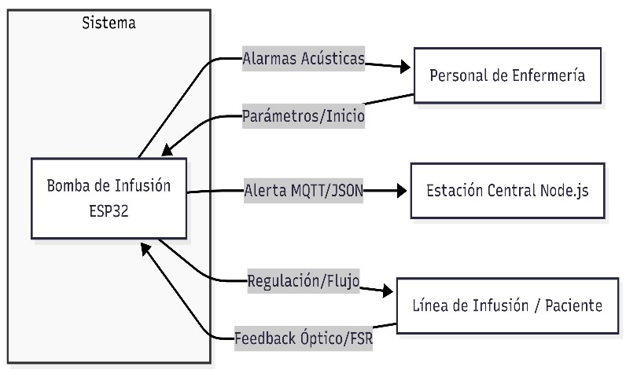
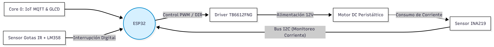
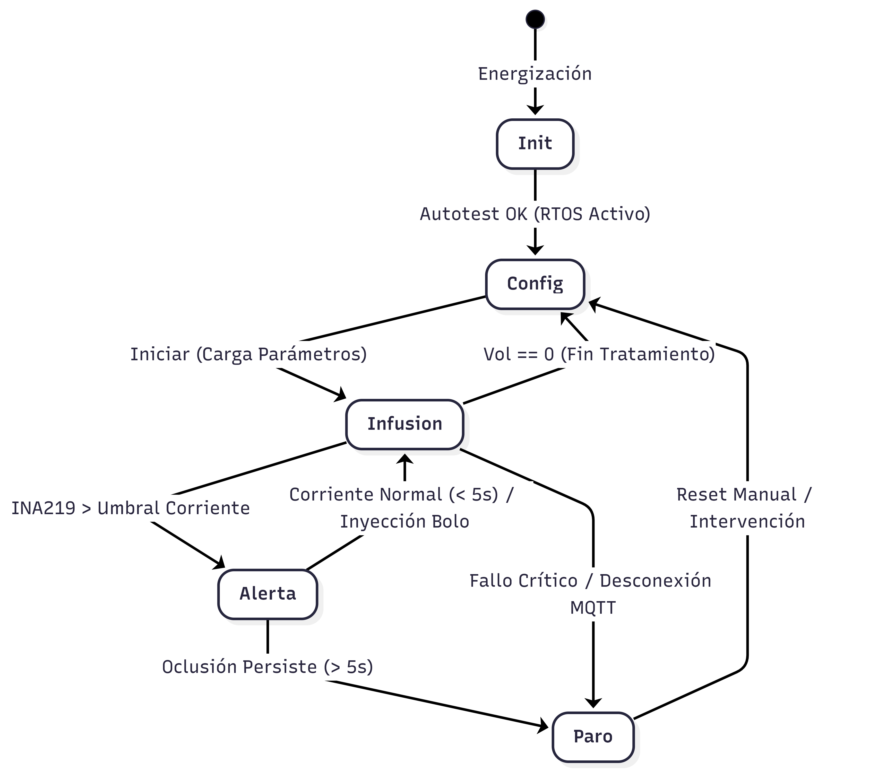
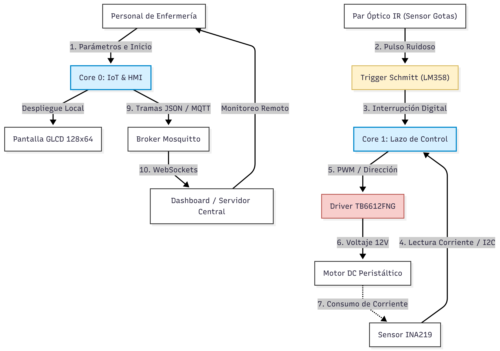

# Documento de Diseño: Sistema Inteligente de Bomba de Infusión Intravenosa

Nombre: Allan Muguerza

## 1. Introducción

El desarrollo de sistemas médicos automatizados es fundamental para minimizar los errores humanos en entornos clínicos de alta presión. En la administración de medicamentos por vía intravenosa, la precisión del volumen y la tasa de infusión son determinantes para la seguridad y la recuperación del paciente. Las alternativas tradicionales suelen ser costosas, rígidas y carecen de conectividad remota fluida.

**Objetivo General:** Diseñar e implementar un sistema embebido para una bomba de infusión intravenosa inteligente mediante una arquitectura de señal mixta, lógica concurrente en RTOS y telemetría IoT para optimizar la precisión del flujo y la seguridad en la monitorización de pacientes.

## 2. Alcances y Limitaciones

**Qué se va a crear:** Un dispositivo médico embebido autónomo basado en el microcontrolador ESP32 de doble núcleo que opera bajo FreeRTOS. Incluye un mecanismo de bombeo con motor peristáltico DC accionado mediante el driver TB6612FNG por modulación PWM, un subsistema óptico infrarrojo con Trigger Schmitt para la detección y conteo de gotas en tiempo real, un sensor de corriente y voltaje INA219 para detectar sobrecargas y oclusiones por consumo eléctrico, una pantalla local para configuración de parámetros y un módulo de telemetría MQTT vía Wi-Fi hacia un servidor central.

**Qué NO se va a resolver:** El proyecto no contempla el diseño de la carcasa externa, pruebas de compatibilidad química de materiales plásticos ni certificaciones comerciales formales (como FDA o IEC 60601) para uso en humanos. Tampoco se incluye conexión directa a la red eléctrica de alta tensión, limitándose al aislamiento de la etapa del motor. Asimismo, queda fuera del alcance de este prototipo la inclusión de una batería de respaldo y el sistema de conmutación automática ante cortes de luz, operando el equipo con una fuente DC regulada de laboratorio.

## 3. Diagrama de Contexto

**Usuario (Enfermería):** Configura el volumen total y la tasa de infusión en la HMI. Recibe alertas acústicas locales ante fallos.

**Bomba de Infusión (Sistema Central):** Procesa sensores, regula el flujo mediante la modulación PWM hacia el driver TB6612FNG con validación por sensor de gotas IR, detecta sobrecorriente con el INA219 y ejecuta paros de emergencia.

**Entorno Clínico / Red IoT:** Supervisa a distancia el estado del tratamiento, volumen y alertas prioritarias.

## 4. Diagrama de Bloques del Diseño

**Distribución de tareas en FreeRTOS y hardware:**Para asegurar que el funcionamiento de la bomba no se congele por problemas de red, el trabajo se divide entre los dos núcleos del ESP32:

* **Core 0 (Comunicaciones e Interfaz):** Atiende la conexión Wi-Fi, la publicación de alertas por MQTT y el refresco de la pantalla gráfica. Si la red se cae o presenta demoras, este núcleo absorbe el tiempo de espera sin alterar el bombeo.
* **Core 1 (Control en Tiempo Real y Sensores):** Genera la señal PWM hacia el driver TB6612FNG para mover el motor, atiende por interrupción de hardware cada pulso del sensor de gotas IR y monitorea continuamente la corriente del motor a través del sensor INA219.

**Detección de Atascos por Consumo Eléctrico:** En lugar de sensores mecánicos externos, el sensor INA219 mide continuamente la corriente del motor peristáltico. Si la manguera se obstruye, el motor hace mayor fuerza y su consumo eléctrico sube. Al rebasar el umbral de seguridad, el Core 1 detiene el driver de inmediato y dispara la alarma.

## 5. Diagrama de Software o Máquina de Estados

## 6. Diagrama/Diseño de Interfaces

**Control de Flujo y Regulación por PWM:**
La velocidad del motor peristáltico se controla mediante la señal PWM enviada al driver TB6612FNG. El sistema calcula el intervalo de tiempo esperado entre cada gota según la tasa programada. Si el sensor infrarrojo detecta que las gotas caen más lento o más rápido de lo esperado, el microcontrolador ajusta suavemente el ciclo de trabajo del PWM para compensar la velocidad y mantener la dosis correcta.

**Detección de Oclusión con Sensor INA219:**
El sensor INA219 monitorea el voltaje y la corriente del motor a través del bus I2C. En funcionamiento normal, la corriente se mantiene en un rango estable. Si ocurre una oclusión en la línea de infusión, la corriente supera el umbral crítico durante más de 3 segundos, lo cual activa el protocolo de paro de emergencia y el despacho de la alerta por MQTT.

**Manejo del Factor de Goteo y Calibración:**
La tasa programada en mililitros por hora se convierte a frecuencia de goteo con la siguiente relación:

$$
\text{Gotas por minuto} = \frac{\text{Flujo en mL por hora} \times \text{Factor de Goteo}}{60}
$$

* **Tipos de equipo:** El usuario selecciona en el menú inicial si utiliza macrogotero (10, 15 o 20 gotas por mililitro) o microgotero (60 gotas por mililitro).
* **Calibración de volumen:** El sistema cuenta con una rutina de prueba donde se bombean 10 mililitros a una probeta graduada, se registra el volumen real obtenido y se guarda el factor de ajuste en la memoria flash del ESP32.
* **Validación en vivo:** El sensor óptico infrarrojo con Trigger Schmitt detecta la caída de cada gota. Si no se registran gotas durante un tiempo prolongado mientras el motor está activo, se dispara una alarma por contenedor vacío o presencia de burbujas en la línea.

## 7. Alternativas de Diseño

| Criterio de Selección            | Alternativa Evaluada                                             | Solución Implementada                                       | Justificación Técnica                                                                                                                                      |
| --------------------------------- | ---------------------------------------------------------------- | ------------------------------------------------------------ | ------------------------------------------------------------------------------------------------------------------------------------------------------------ |
| **Monitoreo de Flujo**      | Balanzas o celdas de carga mecánicas.                           | Sensor óptico infrarrojo con Trigger Schmitt.               | Evita descalibraciones por movimiento del soporte y valida gota a gota sin contacto físico con el fluido.                                                   |
| **Detección de Oclusión** | Sensor de fuerza resistivo (FSR) montado en la manguera.         | Sensor de corriente y voltaje INA219 en la línea del motor. | Mide directamente el sobreesfuerzo eléctrico del motor ante cualquier atasco u obstrucción, evitando calibraciones mecánicas complejas sobre la manguera. |
| **Etapa de Potencia**       | Circuitos discretos con transistores o puentes H convencionales. | Driver compacto TB6612FNG controlado por PWM desde el ESP32. | Ofrece alta eficiencia energética, bajo calentamiento y control directo de giro y velocidad con bajo consumo de pines.                                      |

## 8. Plan de Test y Validación

**Test 1:** Programar tasas de 50 ml/h y 250 ml/h. Medir el volumen real recolectado en una probeta graduada tras una hora. **Criterio de Aceptación:** El error acumulado entre las gotas validadas ópticamente por el sensor IR, la tasa calculada por PWM y el volumen real medido debe ser inferior al 2%.

**Test 2:** Respuesta ante Oclusiones (Protocolo Escalonado): Obstruir mecánicamente la manguera de salida en marcha activa. **Criterio de Aceptación:** Al superar el umbral de corriente en el sensor INA219 a través del bus I2C, el zumbador emite un pitido intermitente por un máximo de 5 segundos. Si el bloqueo persiste, el motor se detiene inmediatamente apagando el driver TB6612FNG y despacha la alerta MQTT en menos de 500 ms.

**Test 3:** Concurrencia bajo Carga Temporal (RTOS): Desconectar el Broker MQTT abruptamente mientras la pantalla se actualiza o se inyecta un bolo. **Criterio de Aceptación:** Las señales PWM enviadas por el Core 1 al driver TB6612FNG no deben presentar fluctuaciones ni congelamientos, demostrando el aislamiento total de tareas críticas frente a las secundarias.

## 9. Consideraciones Éticas y de Seguridad

**Impacto Social:** La democratización de tecnologías médicas con bajo coste de hardware (USD 63.00 estimado) abre el acceso a la salud pública de precisión en entornos de atención rural e instituciones de docencia médica.

**Riesgos Éticos:** Una pérdida de conectividad Wi-Fi o la saturación del servidor Node.js podría inducir una falsa sensación de control remoto en el personal clínico, descuidando la atención presencial. Errores de firmware arriesgan incidentes graves por subdosificación o sobredosificación.

**Estrategias de Mitigación:**

1. **Prioridad Local Absoluta:** El hardware prioriza de manera autónoma las alarmas acústicas y los paros de emergencia locales, operando de forma 100% segura, aunque la red de telemetría IoT colapse por completo.
2. **Fail-Safe Eléctrico:** Desacoplamiento de tierras y fuentes de alimentación entre la lógica digital de 3.3V y la etapa de potencia de 12V del driver TB6612FNG, incorporando protección contra sobrecorriente por hardware mediante el sensor INA219.
